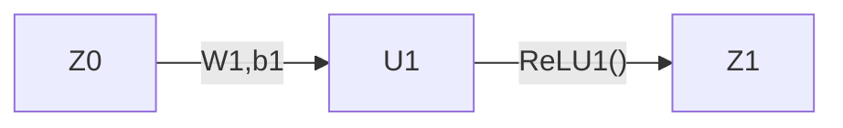
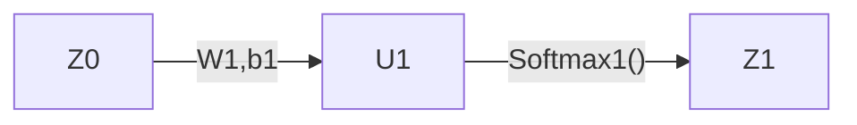

网络模型现在主要采用“前馈架构+反向传播”的设计思路。前馈神经网络是将神经网络分层，层间采用相同的激活函数，相邻的层与层之间进行连接的架构。
![[input.svg|804]]

# 反向传播
## 新的乘法运算
1. 矩阵的点乘
为了研究清楚二阶张量的微分，我们需要考虑矩阵的乘法运算，也就是点乘与圆点乘运算。首先我们来介绍一下矩阵的圆点乘运算，类比一阶张量（向量），矩阵的点乘运算计算的是矩阵的内积。
$$
	A \cdot B :=
$$
矩阵的点乘具有交换律以及转置不变性
$$
	A \cdot B = B \cdot A=A^T \cdot B^T
	\tag{1}
$$
矩阵的点乘与矩阵的乘积具有一些联系。例如一个点乘对应多个叉乘的迹的表示。又或者点乘的顺序可以适当重排。
$$
	A \cdot B = \rm{tr}(A^TB) = \rm{tr}(AB^T)=\rm{tr}(BA^T) = \rm{tr}(B^TA)
	\tag{2}
$$
$$
	A \cdot BC = B^TA \cdot C
	\tag{3}
$$
矩阵的加法与点乘之间具有分配律
$$
	A \cdot (B+C) = A \cdot B + A \cdot C
	\tag{4}
$$
2. 矩阵的圆点乘
矩阵的圆点乘类比矩阵点乘，也是一种逐元素的运算，不过圆点乘会保持矩阵的形状不变。
$$
	A \odot B:=
$$
矩阵的圆点乘具有交换律，以及针对转置的分配律
$$
	A \odot B = B \odot A = (A^T \odot B^T)^T
	\tag{5}
$$
矩阵加法与圆点乘之间具有分配律
$$
	A \odot (B+C) = A \odot B + A\odot C
	\tag{6}
$$
矩阵点乘和圆点乘之间具有交换律
$$
	A \cdot (B \odot C) = (A \odot B) \cdot C
	\tag{7}
$$
与此同时，矩阵的圆点乘对于深度学习训练有良好的优势，如果单个样本满足规律$dz = a \odot du$，那么对于一个Batch就满足
$$
	dZ = A \odot dU
	\tag{8}
$$
## 微分乘法分析
我们将在上述矩阵乘法的帮助下，利用微分法进行反向传播的梯度传播计算，不同的矩阵乘法会负责表示不同对象的微分运算。
1. 对损失函数的微分
神经网络的损失函数通常采用均方误差（回归）或者交叉熵（分类）函数，因此我们分别分析这两类损失函数的微分规律。
2. 对$\text{ReLU}$函数的微分
设单个样本满足$\bm{z}=\text{ReLU}(\bm{u})$，那么有如下微分式
$$
	\begin{aligned}
		d\bm{z} &= \text{diag}(\text{ReLU}'_\bm{u}) d\bm{u}
		\\[0.8em]
		&= \text{ReLU}_\bm{u}' \odot d\bm{u}
	\end{aligned}
$$
对于一批样本数据$Z=\text{ReLU}(U)$，有如下微分式
$$
	dZ = \text{ReLU}_\bm{U}' \odot dU
$$
1. 对$\text{Softmax}$的微分
首先我们注意到向量函数$\rm{Softma}x:\mathbb{R}^n\to\mathbb{R}^n$，$\bm{u}\mapsto\bm{z}=\big(\bm{z}_1, \cdots, \bm{z}_n\big)$，关于分量的偏导数满足
$$
	\frac{d\bm{z}_i}{du_j}=\bm{z}_i(\delta_{ij}-\bm{z}_j)
$$
设向量$\bm{z}=\text{Softmax}(\bm{u})$，那么有如下微分式。其中因为第二项存在一个满元素的的$C \times C$的矩阵，因此没法压缩成点积的形式。
$$
	\begin{aligned}
		d\bm{z} &= \big[\text{diag}(\bm{z}) - \bm{z}\times\bm{z} \big] d\bm{u}
		\\[0.5em]
		&=\bm{z} \odot d\bm{u} - \bm{z}\times\bm{z}d\bm{u}
	\end{aligned}
$$
对于一批样本数据$Z=\text{Softmax}(U)$，考虑单个行样本，有如下微分式。其中导数$J_{\bm{z}}{u}=\big[\text{diag}(\bm{z}) - \bm{z}\times\bm{z} \big]$是一个对称矩阵。
$$
	\begin{aligned}
	d\bm{z} &= d\bm{u}\big[\text{diag}(\bm{z}) - \bm{z}^T\bm{z} \big]
	\\[0.5em]
	&=\bm{z} \odot d\bm{u} - (d\bm{u}\bm{z}^T)\bm{z}
	\\[0.5em]
	&=\bm{z} \odot d\bm{u} - (d\bm{u}\bm{z}^T)\mathbb{1}^{1\times \text{out}} \odot \bm{z}
	\\[0.5em]
	&=\bm{z} \odot \big(d\bm{u} - (d\bm{u}\bm{z}^T)\mathbb{1}^{1,\text{out}}\big)
	\\[0.5em]
	&=\bm{z} \odot \big(d\bm{u} - (d\bm{u} \odot \bm{z})\mathbb{1}^{\text{out}\times 1}\mathbb{1}^{1\times\text{out}} \big)
	\\[0.5em]
	&=\bm{z} \odot \big(d\bm{u} - (d\bm{u} \odot \bm{z})\mathbb{1}^{\text{out}\times\text{out}} \big)
	
	\end{aligned}
$$
根据单个样本呈现的这个规律，我们就可以推广到整个Batch的规律上。事实上整个Batch满足的微分式为
$$
	dZ = Z \odot \big(dU - (dU \odot Z)\mathbb{1}^{\text{out}\times1}\mathbb{1}^{1\times\text{out}} \big)
$$
1. 对二阶张量的微分
将上述三类函数的微分规律汇总，就能得到如下微分规律。针对零阶张量函数$\mathcal{L}=\varphi(Z)$的微分满足
$$
	d\mathcal{L}=\varphi_Z' \cdot dZ
	\tag{8}
$$
对于二阶张量函数，如果是逐元素函数，比如中间层的激活函数$Z=\rm{ReLu}(U)$等，微分的规律满足
$$
	dZ=\Phi_U' \odot dU
	\tag{9}
$$
对于二阶张量函数，如果是逐行函数，比如输出层的激活函数$Z=\rm{Softmax}(U)$等，微分的规律满足
$$
	dZ = Z \odot \big(dU - (dU \odot Z)\mathbb{1}^{\text{out}\times\text{out}} \big)
$$
### 单层网络的分析（1）
现在让我们考虑一个一层的神经网络，网络架构如下。网络训练的$\rm{batch\_size}=N$，网络的权重矩阵为$W\in\mathbb{R}^{\rm{out}, \rm{in}}$，网络的偏置项为$\rm {b}\in\mathbb{R}^{out}$，网络的激活函数为$\rm{\Phi={ReLu, Logistic}}$等逐元素作用的激活函数。
![[single-layer-network.svg|650]]
整个网络的计算图为

在反向传播的过程中，我们需要计算损失函数对应权重的梯度，这里我们采用微分的方法来分析，通常微分法比求导法更加方便。针对损失函数的微分满足下式，这里$\rm{Z_1}$是一个$\rm{batch}$矩阵。
$$
	dL=\frac{dL}{dZ_1} \cdot dZ_1
	\tag{a.1}
$$
针对单层的输出$Z_1$，由于$\Phi$是权重的逐元素作用二阶张量函数，微分式满足
$$
	\begin{aligned}
		dZ_1&=d\big[\Phi(U_1)\big]=\Phi'_{U_{1}} \odot d(U_1)\xlongequal{U_1=Z_0W^T+b}\Phi'_{U_{1}} \odot (Z_0dW^T+db)
		\\[0.8em]
		&=\Phi'_{U_{1}} \odot (Z_0dW^T) + \Phi'_{U_{1}} \odot (db)
	\end{aligned}
	\tag{a.2}
$$
综合上述式子，我们得到损失函数对于权重矩阵和偏置项的微分公式
$$
	\begin{aligned}
		dL &= \frac{dL}{dZ_1} \cdot dZ_1 = \frac{dL}{d{Z_1}} \cdot \big(\Phi_{U_{1}} \odot (Z_0dW^T) + \Phi_{U_{1}} \odot (db)\big)
		\\[0.8em]
		&= \frac{dL}{dZ_1} \cdot \big(\Phi_{U_{1}} \odot (Z_0dW^T)\big) + \frac{dL}{dZ_1}\cdot\big(\Phi_{U_{1}} \odot (db)\big)
		\\[0.8em]
		&= (\frac{dL}{dZ_1} \odot \Phi_{U_1}) \cdot (Z_0dW^T) + (\frac{dL}{dZ_1} \odot \Phi_{U_1}) \cdot db
		\\[0.8em]
		&=(\frac{dL}{dZ_1} \odot \Phi_{U_1})^TZ_0 \cdot dW + (\frac{dL}{dZ_1} \odot \Phi_{U_1}) \cdot db
	\end{aligned}
	\tag{a.3}
$$
其中最后一步时利用$A \cdot (BC) = B^TA \cdot C$变换，再通过$A \cdot B = A^T \cdot B^T$变换得到结果式。至此我们求解得到单层神经中损失函数关于权重矩阵的偏置项的梯度。
$$
	\frac{d\mathcal{L}}{dW} = (\frac{dL}{dZ_1} \odot \Phi'_{U_1})^TZ_0
	\tag{a.4}
$$
$$
	\frac{dL}{db} = \underset{\text{axis}=0}{\text{sum}}\big(\frac{dL}{dZ_1} \odot \Phi'_{U_1} \big)
	\tag{a.5}
$$

### 单层网络的分析（2）
现在我们还是考虑一个单层神经网络，但是激活函数变换了。原先层中逐元素作用的$\rm{ReLU}$激活函数被替换为逐行作用的$\rm{Softmax}$函数，需要重新计算激活函数的导数，现在我们在这个基础上分析权重矩阵和偏置项的梯度。
![[single-layer-network.svg|650]]
整个网络的计算图为

仍然按照刚才的过程，针对损失函数的微分满足
$$
	d\mathcal{L}=\frac{d\mathcal{L}}{dZ_1} \cdot dZ_1
	\tag{b.1}
$$
针对本层输出$Z_1$的微分满足
$$
	dZ_1 \xlongequal{Z_1=\text{Softmax}(U_1)} Z_1 \odot \big(dU_1 - (dU_1 \odot Z_1)\mathbb{1}^{\text{out}\times1}\mathbb{1}^{1\times\text{out}} \big)
$$
而针对线性变换的微分满足
$$
	dU_1 \xlongequal{U1=Z_0W_1 + \bm{b}_1} Z_0dW_1 + d\bm{b}_1
$$
综合上式可以得到损失函数针对本层权重矩阵和偏置项的微分为
$$
	d\mathcal{L}=\frac{d\mathcal{L}}{dZ_1} \cdot \Big(Z_1 \odot \big(dU_1 - (dU_1 \odot Z_1)\mathbb{1}^{\text{out}\times\text{out}} \big)\Big)
$$
### 多层网络的分析
这一次我们在刚才的基础上增加更多的隐藏层，形成一个一般的神经网络。我们将对其中的任意一层计算权重矩阵和偏置项的梯度。新的网络相比于刚才的单层网络新增了如下特性：（1）网络的层数更多，大多数层用于特征学习，最后一层用于输出；（2）学习层采用逐元素作用的$\rm{ReLU}$等函数，而输出层采用逐行作用的$\rm{Softmax}$函数。