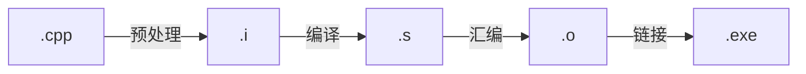

# 语言特性

## 变量
### 变量的传递
在C++中变量的本质就是内存，在C++中对象传递行为默认是复制语义。具体内容请参考[[语言哲学/程序语言/C+/基础语法/数据类型/数据类型|数据类型]]中有关变量传递的内容。

### 变量的范围
变量的范围的主要是指变量的作用域、生命周期。变量可以根据作用域分为全局变量、局部变量。具体内容请参考[[语言哲学/程序语言/C+/基础语法/数据类型/数据类型|数据类型]]中有关数据的范围内容。

## 标识符
### 等于符号
在所有的程序设计语言中，等于符号一般都表示变量的传递，然而传递本身有多种物理含义：复制语义（值复制与址复制）、移动语义。

# 编译过程
在C++中程序文本要转化为进程通常经过预编译、编译、链接、运行四个主要过程。

其中整个编译仅限于对`cpp`文件进行编译，每个cpp文件单独进行编译。头文件`hpp`, `tpp`通常是以使用预处理指令#include"引入到编译过程中。

# 内存布局
运行时C++内存布局如下，其中运行时不会存储任何模板定义、类定义、命名空间的信息，这些工作已经在编译和链接的时候就已经完成。
```text
进程虚拟地址空间
高地址
│
├── 栈区 （多线程各自有独立的栈）
│   ├── 函数参数
│   ├── 局部变量
│   ├── 返回地址
│   └── 栈帧信息
│
├── 内存映射区
│   ├── 动态链接库
│   └── 文件映射
│
├── 堆区
│   └── 动态创建的对象
│
├── BSS-DATA 区
│   ├── 未初始化的全局/静态变量
│   └── 零初始化的全局/静态变量
│
├── Data 区
│   ├── 非零初始化的全局变量
│   └── 非零初始化的 static 变量
│
├── Read Data区
│   ├── 常量
│   └── 只读常量
│
└── 代码区
    └── 编译后的机器指令
低地址
```


