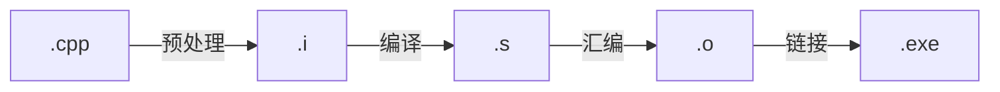
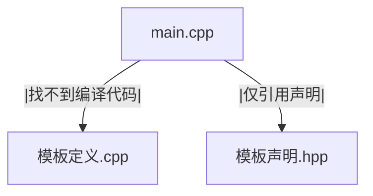

# 语言特性

## 变量
### 变量的声明与定义
在C+中变量标识符本质上是装载数据与指令的内存空间。向变量初次加载数据与指令的过程就是初始化，往后再次对变量数据或指令进行重新加载的过程就是赋值。

## 标识符的特性
### 等于符号
在C++中等于符号所代表的行为比较多，主要原因是C++允许对象本身与指向对象的指针同时存在。解读其含义需要依赖上下文来看，大致可以分为构造和赋值两种行为，区分条件就是左边的变量标识符在当前作用域下是否出现过。而针对构造和赋值两种行为内部，又分为复制和移动两种子行为，区分条件就是右边的变量是左值（具名对象）还是右值（临时对象）。一个判断左值和右值对象的标准就是其是否具名或者能取地址：具名的或者能进行取址运算的对象就是左值对象，反之就是右值对象。

## 内存布局
运行时C++内存布局如下。其中C++的全局变量指的是单个文件内不在任何代码块、函数、类、模板内定义的变量。比较经典的是在代码文件开头时，在主函数之前声明或定义好的变量。相对于Python，C++在运行时不会存储任何模板定义、类定义、命名空间有关的的数据，这些工作已经在编译和链接的时候就已经完成。
```text
进程虚拟地址空间
高地址
│
├── 栈区 （多线程各自有独立的栈）
│   ├── 函数参数
│   ├── 局部变量
│   ├── 返回地址
│   └── 栈帧信息
│
├── 内存映射区
│   ├── 动态链接库
│   └── 文件映射
│
├── 堆区
│   └── 动态创建的对象
│
├── BSS-DATA 区
│   ├── 未初始化的全局/静态变量
│   └── 零初始化的全局/静态变量
│
├── Data 区
│   ├── 非零初始化的全局变量
│   └── 非零初始化的 static 变量
│
├── Read Data区
│   ├── 常量
│   └── 只读常量
│
└── 代码区
    └── 编译后的机器指令
低地址
```


# 编译过程
在C++中高级语言要转化为二进制语言通常经过以下这个过程。

其中整个编译仅限于对`cpp`文件进行编译，头文件"hpp, tpp"通常是以使用预处理指令`#include"`引入到编译过程中。

对于模板编程，最好将模板的声明放在`hpp`文件中，将模板的实现放在`tpp`文件中，并且让`hpp`文件包含`tpp`文件。而不是像类与对象的做法将模板的实现放入`cpp`文件中。

因为编译器在单独编只包含模板类或模板函数定义的`cpp`文件时，如果没有遇到具体调用，一般不会编译生成具体的代码，这导致在其他文件`cpp`中调用模板类或模板方法的时候找不到具体实现代码，从而抛出链接错误。而`hpp+tpp`的方法将声明与定义统一在同一个头文件中，任何引入该头文件并调用模板类或模板方法的`cpp`文件都可以从这里找到实现代码。
