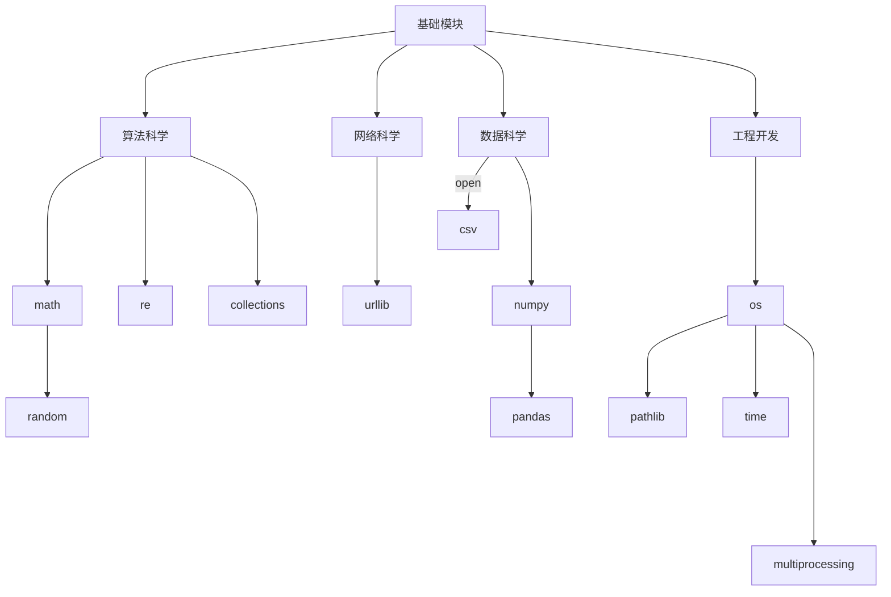

```mermaid
graph TD
A["基础模块"]
B["算法科学"]
C["网络科学"]
D["数据科学"]
E["工程开发"]

B11["math"]
B12["random"]
B2["re"]
B3["collections"]
C1["urllib"]
D1["csv"]
D2["numpy"]
D3["pandas"]
E1["os"]
E2["pathlib"]
E3["time"]
E4["multiprocessing"]

A ---> B
A ---> C
A ---> D
A ---> E
B ---> B11
B11 ---> B12
B ---> B2
B ---> B3
C ---> C1
D --"open"--> D1
D ---> D2
D2 ---> D3
E ---> E1
E1 ---> E2
E1 ---> E3
E1 ------> E4
```