```mermaid
graph LR
A["基础模块"]
B["算法科学"]
C["网络科学"]
D["数据科学"]
E["工程开发"]

B11["math"]
B12["random"]
B2["re"]
B3["collections"]
C1["urllib"]
D1["csv"]
D2["numpy"]
D3["pandas"]
E1["os"]
E2["typing"]
E3["functools"]
E11["pathlib"]
E12["time"]
E13["multiprocessing"]

A ---> B
A ---> C
A ---> D
A ---> E
B ---> B11
B11 ---> B12
B ---> B2
B ---> B3
C ---> C1
D --"open"--> D1
D ---> D2
D2 ---> D3
E ---> E1
E ---> E2
E ---> E3
E1 ---> E11
E1 ---> E12
E1 ---> E13
```

# 语言特性
## 内存布局
在Python中标识符本质上是指针。赋值`=`运算将左方指向右方。关于数据类型的可变性，可以参考[[语言哲学/程序语言/Python/基础语法/数据类型/数据类型]]中的相关内容。

在Python中函数对象和默认参数均存储在堆区，函数调用时在栈区创建调用栈，保存局部变量的信息。运行时Python的内存布局如下。其中Python的全局变量是指在单个文件内不在任何函数、类、代码块内部定义的变量。
```text
进程虚拟地址空间  
├── 高地址  
│  
├── Stack 段 （通常向低地址增长）（多线程各自有独立的栈）
│ └── 线程栈
|   └── 函数调用栈      
│  
├── MMap 段  
│ ├── 扩展模块机器指令  
│ └── 通常向低地址增长  
│  
├── Heap 段  
│ ├── 类型
| ├── 对象  
│ ├── 命名空间  
│ └── 通常向高地址增长  
│  
├── DATA 段  
│ ├── 未初始化的全局变量和静态变量  
│ ├── 零初始化的全局变量和静态变量  
│ ├── 已初始化的全局变量和静态变量  
│ └── 常量与只读变量  
│  
├── Code 段  
│ └── 主程序机器指令  
│  
└── 低地址
```

## 变量赋值
在Python中有一个特殊的机制是多目标赋值。
```python
a = 1, b = 2
a, b = a+1, a+b		# 先计算右边所有表达式的值，在更新左边
print(a, b)			# a = 1+1, b = 1+2

```

