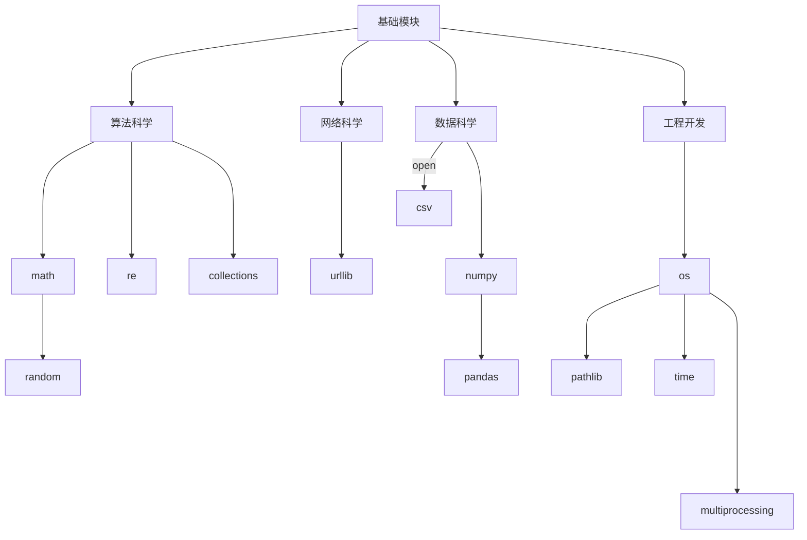

# 语言特性
## 内存机制
在Python中标识符本质上指向类型对象的内存空间。赋值`=`运算将标识符绑定到给定的内存空间上。变量语义默认是地址语义。

在Python中类型基本上分为可变类型和不可变类型两类，典型的不可变类型为`int`、`float`、`bool`、`str`、`tuple`等，典型的可变类型为`list`、`dict` 、`set`、`class`等。不可变类型不能进行原地修改，可变类型可以通过特定方法进行原地修改。

在Python中函数对象和默认参数均存储在堆区，函数调用时在栈区创建调用栈，函数调用默认是传址调用。