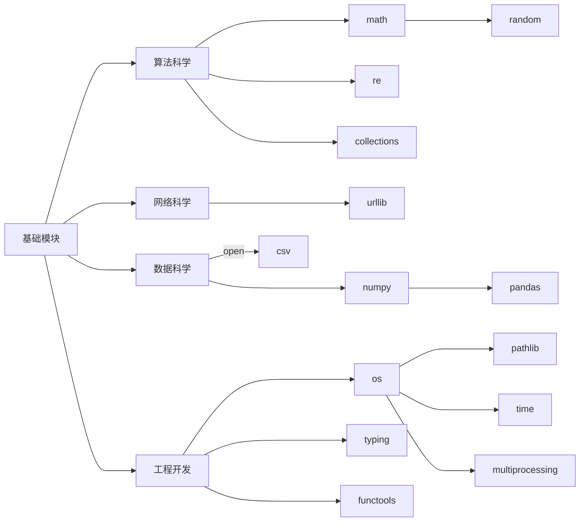

# 语言特性
## 内存机制
在Python中标识符本质上是指针。赋值`=`运算将左方指向右方。

在Python中类型基本上分为可变类型和不可变类型两类，典型的不可变类型为`int`、`float`、`bool`、`str`、`tuple`等，典型的可变类型为`list`、`dict` 、`set`、`class`等。不可变类型不能进行原地修改，可变类型可以通过特定方法进行原地修改。

在Python中函数对象和默认参数均存储在堆区，函数调用时在栈区创建调用栈，函数调用默认是传址调用。

## 作用范围
在Python根据代码的结构可以将代码分为Local、Enclosure、Global、BuiltIn（LEGB）四大类命名空间，标识符的在不同命名空间内的可见性质称为标识符的作用域。关于如何判定一个标识符属于哪一个作用域，在Python中判别依据是是否出现绑定行为：解释器会将触发过绑定行为的标识符判定为当前代码块内的局部变量。也就是说在当前代码块中，具有绑定行为的变量（比如具有赋值行为的变量）判定为当前代码块中的局部变量，将不具有绑定行为的变量（比如没有赋值行为的变量、通过`globl`、`nonlocal`声明的变量）判定为自由变量，自由变量的值会按照LEGB的顺序进行查找。