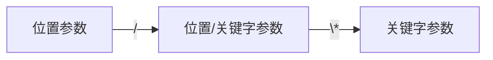

# 函数的定义
函数的返回值可以是无返回值、单个返回值、多个返回值。多个返回值会以元组的形式返回，且支持解包。函数的返回类型也可以是一个函数对象。
## 函数的参数
函数的参数和函数体会有自己的静态存储空间。如果一个参数是可变类型，那么多次调用这个函数访问以及修改的是同一个变量。函数的参数传递默认是地址传递。

函数在设计的时候可以通过`/`与`*`指定绑定参数的方式，总体顺序按照：位置参数->关键字参数的顺序传入参数，这其中`/`表示之前的参数是位置参数，符号`*`表示之后的参数是关键字参数，二者中间的参数既可以是位置也可以是关键字参数。

### 参数打包机制
在Python中可以通过`*args`和`**kwargs`表示可以接收任意数量的参数，其中`*args`会以元组的形式接收位置参数，而`**kwargs`会以字典的形式接收关键字参数。

## 匿名函数
匿名函数的定义形式如下：
```python
function = lambda params: pass

## Example1
### 等价写法：
(lambda x,y: True if x+y >= 1 else False)(1,2)
### 等价写法：
function = lambda x,y: True if x+y >= 1 else False
function(1,2)
```

## 生成函数
函数内部如果有`yield`关键字就称为生成函数，生成函数是一类可迭代对象。其中`yield`是一种具有交互性质的关键字，它首先会暂停当前函数的执行，并将所在的表达式的初始值返回到外部，随后在后续指令中等待`next`、`send`等方法调用，并带着调用值继续生成器的执行（调用参数默认为None类型）。生成器函数具有惰性计算的性质。


## 装饰函数
函数装饰器（Decorator）分为普通函数装饰器和类装饰器。这里我们先介绍前者，后者会在[[面向对象编程]]中进行介绍。函数装饰器本质上是一个"接受函数，返回函数"的函数。装饰器技术的发展基于闭包机制，装饰器技术有助于减少代码冗余、增加代码复用效率。
### 装饰器的定义
定义并使用一个函数装饰器的方法如下：
```python
from functools import wraps
# Template1
def decorator(func):
	@wraps(func)
	def wrapper(*args, **kwargs):
		pass
	return wrapper

@decorator
def func():
	pass
	
# Template2
def meta_decorator(params):
	def decorator(func):
		@wraps(func)
		def wrapper(*args, **kwargs):
			pass
		return wrapper
	return decorator

@meta_decorator(params)
def func():
	pass
```
当一个函数被修饰时，函数标识符的含义实际上相当于如下的语法形式：
```python
# 等价写法0
@decorator
def func(*args, **kwargs):
	pass
	
# 等价写法1
def func(*args, **kwargs):
	pass
func = decorator(func)
```

```python
# 等价写法1
@meta_decorator(params)
def func(*args, **kwargs):
	pass
	
# 等价写法2
def func(*args, **kwargs):
	pass
decorator = meta_decorator(params)
func = decorator(func)
```
### 执行顺序
当多个装饰器同时装饰一个函数时，会按照自下向上的顺序进行复合装饰。

# 函数的调用
在调用函数的时候，应当遵循如下的传递参数顺序：
> 固定位置参数 > 变长位置参数 > 固定关键字参数 > 变长关键字参数

在函数调用时，要注意默认参数值的初始化特性，也就是说函数的默认参数只会初始化一次，多次调用均会访问同一个对象。对于可变类型比如`List`、`Dict`等，这样子的默认参数有共享风险。
```python
## Example1
def add_item(x, items=[]):
    items.append(x)
    return items
In[0]: print(add_item(1), add_item(2), add_item(3))
Out[0]: [1,2,3], [1,2,3], [1,2,3]

## CounterExample1
def add_item(x):
	items = []
    items.append(x)
    return items
In[0]: print(add_item(1), add_item(2), add_item(3))
Out[0]: [1], [2], [3]
```

# 函数的闭包
函数的闭包机制是一种上下文管理机制，该机制能够返回一个能够记忆状态的函数。外层函数的参数或者局部变量都可以作为闭包参数。
```python
# Closure of Function
## Example1
def make_multiplier(factor: int):
    print(f"id of outer factor {id(factor)}")
    def multiplier(x: int) -> int:
        print(f"id of inner factor {id(factor)}")
        return x * factor
    return multiplier

In[0]: make_multiplier(2)
Out[0]:
id of outer factor 140707399955272
id of inner factor 140707399955272
```
```python
## Example2
def make_normalizer(min_val: float, max_val:float):
    range_val = max_val - min_val
    def normalize(x: float) -> float:
        return (x - min_val) / range_val;
    return normalize

score_normalizer = make_normalizer(0, 100)
print(score_normalizer.__closure__[0].cell_contents)	# 0
print(score_normalizer.__closure__[1].cell_contents)	# 100
```
### 动态绑定问题
在实际使用的时候，需要避免动态绑定的问题。在这个例子中，由于没有定义时存储局部变量i的信息，列表中定义的所有闭包函数在运行时只能向外查找并返回i变量的最后取值。
```python
## Example3 DANGER
functions = [lambda: i for i in range(5)]

print([f() for f in functions])		# out: [4,4,4,4]
```

