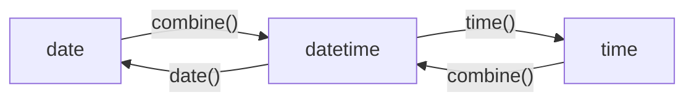

在Python中与时间相关的数据类型集成在`time`和`datetime`模块中。
```python
import time

import datetime
from datetime import date
from datetime import time
from datetime import datetime
from datetime import timedelta
from datetime import timezone
```
# 时间类型的定义
在Python中时间类型分为时间戳类型、结构时间类型、。
## Time Stamp

| 函数          | 功能        |
| ----------- | --------- |
| time()      |           |
| time_ns()   |           |


```python
# time.time
"""
Returns
-------
返回一个float对象表示时间，默认为当地时间。
"""
timestamp1 = time.time()
timestamp2 = time.time_ns()
```
## Time Struct

| 函数          | 功能        |
| ----------- | --------- |
| gmtime()    | 采用UTC时间   |
| localtime() | 采用UTC+x时间 |
```python
# time.localtime
"""
Returns
-------
返回一个struct_time类型对象，类似于结构体，可以按照结构体类型的结构进行信息访问。
"""
time = time.localtime()
```


## Date

```python
# datetime.date
date(
"""
Returns
-------
返回一个date类型。
"""
	year,
	month,
	day
)
```


## Time

| 函数     | 功能  |
| ------ | --- |
| time() |     |

```python
# datetime.time
"""
Returns
-------
返回一个time类型。
"""
time(
	hour,
	minute,
	second
)
```


## Date Time

## Calendar

| 函数         | 功能                      |
| ---------- | ----------------------- |
| ***对象创建*** | <                       |
| datetime() |                         |
| now()      |                         |
| date()     |                         |
| time()     |                         |
| ***对象转换*** | <                       |
| strftime   |                         |
| strptime   | 将`str`对象转化为`datetime`对象 |
| ***属性读取*** | <                       |
| day        | day of month            |
| weekday    | day of week             |
| isoweekday | day of week             |


## 类型转换
### Time Module
在`time`模块中类型转换的对应规则如下：


时间戳和结构时间类型时间可以通过`localtime()`和`mktime()`函数进行转换。

| 函数       | 功能  | 备注                 |
| -------- | --- | ------------------ |
| strftime |     | string format time |
| strptime |     | string parse time  |

其中日期类型的格式如下：

| 格式  | 功能  | 备注               |
| --- | --- | ---------------- |
| %Y  | 年   | xxxx             |
| %y  | 年   | xx               |
| %m  | 月   | 1,01,12          |
| %B  | 月   | January,December |
| %b  | 月   | Jan,Dec          |
| %d  | 日   | 01,31            |
| %j  | 日   | 01,365,366       |
| %H  | 时   | 00,23            |
| %M  | 分   | 00,59            |
| %S  | 秒   | 00,59            |
| %p  |     | AM,PM            |
| %A  |     |                  |
| %a  |     |                  |
| %b  |     |                  |
| %w  |     |                  |

### DateTime Module

### Calendar Module
