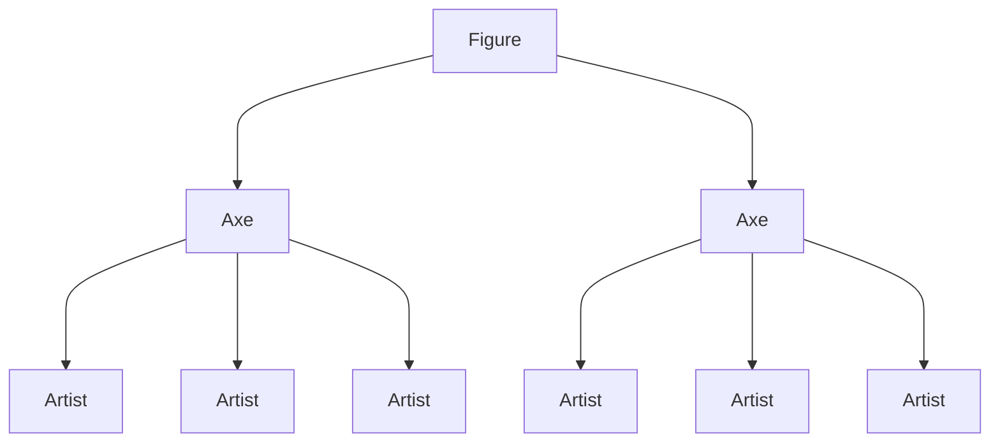

```mermaid
graph TD
A["Figure"]
B1["Axe"]
B2["Axe"]
C11["Artist"]
C12["Artist"]
C13["Artist"]
C21["Artist"]
C22["Artist"]
C23["Artist"]

A ---> B1
A ---> B2
B1 ---> C11
B1 ---> C12
B1 ---> C13
B2 ---> C21
B2 ---> C22
B2 ---> C23
```