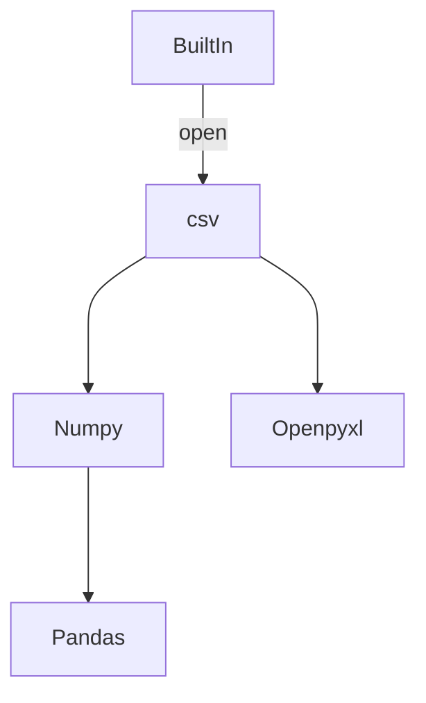

# 文件读写
## 文件访问
在`pathlib`模块的`Path`类型可以通过`iterdir()`方法遍历整个文件夹中的文件。

| 函数        | 功能  | 备注       |
| --------- | --- | -------- |
| iterdir() |     | 返回惰性迭代对象 |
| glob()    |     |          |
| rglob()   |     |          |


在Python`BuiltIn`模块中已经定义了一系列文件交互的接口，实践上经常通过`with`语句与`open()`函数来读打开文件。
## TXT File
对于txt类型的文件可以通过`readline`,`readlines`

| 函数          | 功能             |
| ----------- | -------------- |
| open()      | 打开文件           |
| read()      | 读取全部文本，以字符串返回  |
| readline()  | 读取一行文本         |
| readlines() | 读取全部文本，每行以列表返回 |

```python
# BuiltIn.open
"""
Parameters
----------
file: FilePath
	用于指定文件打开的路径。
mode: ['r', 'w', 'a', 'r+', 'w+', 'a+', 'rb+', 'wb+', 'ab+']
	用于指定文件读写的模式。类似'r'模式表示读取为字符串对象。
encoding: ["utf-8", "gbk", "ascii"]
	用于指定文件解码的格式。
"""
open(
	file,
	mode,
	encoding
)

## Example1
with open("C:\Users\desktop\data.csv") as f:
	pass
```

| 函数      | 功能  |
| ------- | --- |
| write() |     |
```python
# BuiltIn.write
f.write(
	s
)
```

## CSV File
在Python原生的`csv`模块内置了读写csv格式文件的接口，这是一个偏底层的接口，为后续理解`pandas`模块提供了基础。

| 函数           | 功能  |
| ------------ | --- |
| reader()     |     |
| DictReader() |     |
```python
# csv.reader
"""
Usage
-----
逐行读取csv格式的文件数据，按照字符串列表的形式返回。
"""
csv.reader(
	Iterable
)

```

```python
# csv.DictReader
"""
Returns
-------
返回一个DictReader对象，该读取对象具有惰性读取性质，必须通过主动访问或遍历才会读取数据。
"""
csv.DictReader(
	Iterable,
	fieldnames = None
)
```


## Excel File

| 函数              | 功能  |
| --------------- | --- |
| ***对象创建***      |     |
| Workbook()      |     |
| load_workbook() |     |
| save()          |     |
| create_sheet()  |     |
| Cell()          |     |
| ***属性查询***      |     |
| active          |     |
| rows            |     |
| max_row         |     |
| max_column      |     |
| ***数据访问***      |     |
| sheet[...]=...  |     |
| append()        |     |
```python
# openpyxl.[]
## Example
sheet["A1"] = 100		# 对一个单元格进行赋值
```

```python
# openpyxl.cell.cell.Cell
Cell()

## Attributes of Cell object
Cell.value
Cell.row
Cell.column

```
在属性查询中使用`row`属性会得到一个生成器对象，访问生成器对象可以得到其中的Cell对象。

### 格式设置
```python
import openpyxl.styles
```


## Json File
```python
import json
```

| 函数    | 功能  |
| ----- | --- |
| dump  |     |
| dumps |     |
| load  |     |
| loads |     |

